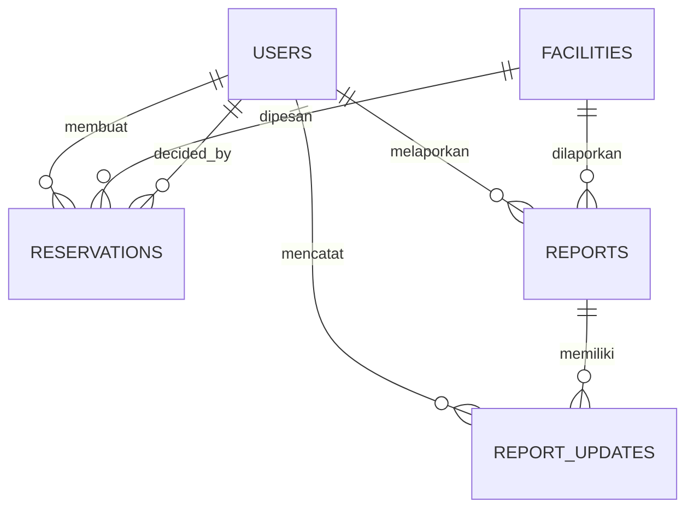
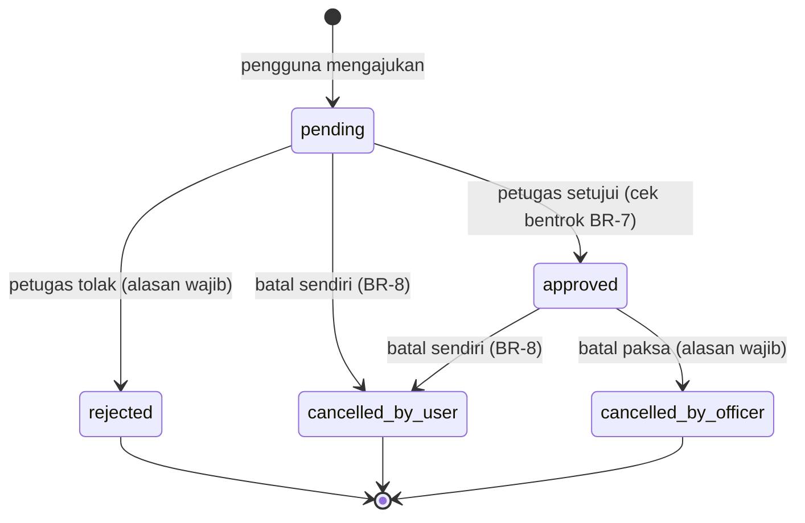
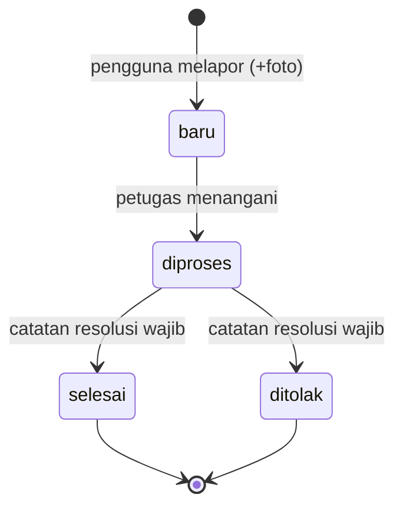

# Spesifikasi Teknis — Sistem Reservasi & Pelaporan Fasilitas Kampus

| Meta | Nilai |
|---|---|
| Proyek | PPK 2026 — Web Platform Sebelum UTS |
| Stack | Laravel 13 (MVC murni, Blade) · MySQL 8 · Tailwind CSS |
| Database | MySQL (via XAMPP/Laragon) |
| Batas pengumpulan | 11 Oktober 2026, 12.00 WIB |

> Dokumen ini adalah **sumber kebenaran tunggal** untuk implementasi. Setiap agen/developer wajib mengikuti spesifikasi ini; jika ada kebutuhan di luar spesifikasi, perbarui dokumen ini lebih dulu dengan commit berpesan jelas.

## 1. Ikhtisar

Aplikasi web untuk mengelola penggunaan fasilitas kampus (ruang kelas, aula, laboratorium, alat, lapangan). Dua alur utama berjalan terpusat dalam satu sistem:

1. **Alur Reservasi** — pengguna mengecek ketersediaan per slot waktu, mengajukan reservasi dengan tujuan penggunaan, petugas menyetujui/menolak/membatalkan.
2. **Alur Pelaporan** — pengguna melaporkan kerusakan fasilitas (kategori, deskripsi, foto), petugas memproses hingga selesai dan memperbarui status ketersediaan fasilitas.

### 1.1 Prinsip Implementasi (ketentuan tugas yang wajib dipenuhi)

- Authentication lengkap: registrasi mandiri, login, logout.
- Struktur kode dipisah minimal: **koneksi DB (Model/migrasi)**, **tampilan (Blade)**, **logika proses (Controller/Service)**.
- Validasi form penting dilakukan **di sisi server DAN sisi client**.
- UI/UX mudah digunakan (responsive dasar, umpan balik yang jelas).
- Minimal ada folder: `/public`, `/app` (model/controller), `/views` (`resources/views`), `/config`.
- Semua anggota tim berkontribusi lewat commit Git dengan pesan yang jelas.

## 2. Stack & Prasyarat Lingkungan

| Komponen | Versi | Catatan |
|---|---|---|
| PHP | >= 8.3 | ekstensi: pdo_mysql, mbstring, fileinfo, gd, zip |
| Composer | >= 2.x | |
| MySQL | 8.x | charset `utf8mb4_unicode_ci`; via XAMPP/Laragon |
| Node.js + npm | >= 20 | untuk build Tailwind (Vite) |
| Laravel | 13.x | PHP 8.3–8.5; security fix s.d. Q1 2028; Laravel 11/12 tidak dipakai (11 EOL Mar 2026, 12 bug-fix berakhir Agu 2026) |

> **Keputusan versi:** Laravel 13 dipilih karena adalah versi utama terkini (rilis Q1 2026) dengan dukungan terpanjang (bug fix s.d. Q3 2027, security s.d. Q1 2028) — aman sampai jauh melewati batas pengumpulan. Konsekuensinya, **PHP minimal 8.3**: pastikan XAMPP/Laragon semua anggota memakai PHP 8.3 atau 8.4. Perubahan dari Laravel 11/12 bagi proyek ini tidak berpengaruh pada desain di dokumen ini (registrasi middleware tetap via `bootstrap/app.php`, auth custom session-based).
>
> **Catatan auth:** sejak Laravel 12, Laravel Breeze tidak lagi dikembangkan. Registrasi/login/logout dibuat **custom (session-based)** dengan `Auth` facade + `Hash::make` + `RateLimiter` — lebih sederhana, tanpa dependency tambahan, dan struktur MVC-nya jelas untuk presentasi.

### 2.1 Konfigurasi `.env` Wajib

```env
APP_NAME="Sistem Reservasi Fasilitas Kampus"
APP_ENV=local
APP_KEY=            # diisi php artisan key:generate
APP_URL=http://localhost:8000

DB_CONNECTION=mysql
DB_HOST=127.0.0.1
DB_PORT=3306
DB_DATABASE=reservasi_kampus
DB_USERNAME=root
DB_PASSWORD=

FILESYSTEM_DISK=public    # untuk foto laporan
SESSION_LIFETIME=120
```

### 2.2 Perintah Setup (juga ditulis di README)

```bash
composer install
npm install && npm run build   # atau npm run dev saat development
php artisan key:generate
php artisan migrate --seed
php artisan storage:link
php artisan serve              # http://localhost:8000
```


## 3. Konvensi Kode & Struktur Folder

```text
sistem-reservasi/
├── public/                      # entry point index.php, aset build (ketentuan tugas)
├── app/
│   ├── Http/
│   │   ├── Controllers/
│   │   │   ├── Auth/            # LoginController, RegisterController, LogoutController (session-based, custom)
│   │   │   ├── FacilityController.php        # publik: daftar + jadwal
│   │   │   ├── ReservationController.php     # pengguna
│   │   │   ├── ReportController.php          # pengguna
│   │   │   ├── Officer/         # petugas: ReservationController, ReportController, FacilityStatusController, DashboardController
│   │   │   └── Admin/           # admin: OfficerAccountController, UserAccountController, FacilityController, RecapController, DashboardController
│   │   ├── Middleware/EnsureRole.php
│   │   └── Requests/            # Form Request (validasi server)
│   ├── Models/                  # User, Facility, Reservation, Report, ReportUpdate
│   ├── Policies/                # ReservationPolicy, ReportPolicy
│   ├── Rules/                   # SlotTimeValid, NoApprovedOverlap, SlotAvailable
│   └── Services/
│       ├── ReservationService.php   # logika slot, bentrok, approve (transaksi)
│       ├── ReportService.php        # transisi status laporan + audit
│       └── RecapService.php         # agregasi okupansi & kerusakan
├── config/                      # database.php, app.php (ketentuan tugas)
├── database/
│   ├── migrations/
│   └── seeders/                 # DatabaseSeeder: akun demo + fasilitas
├── resources/views/             # tampilan Blade (ketentuan tugas: /views)
│   ├── layouts/  components/ui/  fasilitas/  reservasi/  laporan/
│   ├── petugas/  admin/  auth/  dashboard/
├── resources/js/validation.js   # validasi sisi client
├── routes/web.php
└── tests/Feature  tests/Unit
```

Aturan konvensi:
- **Model** hanya berisi relasi, scope, cast, dan query dasar — TIDAK berisi logika alur bisnis.
- **Controller** tipis: validasi (FormRequest) → panggil Service → redirect/view dengan flash message.
- **Service** memuat logika proses (slot, bentrok, transisi status) agar dapat diuji unit.
- **View** Blade hanya presentasi; query TIDAK dilakukan di view.
- Penamaan route pakai titik: `reservasi.create`, `petugas.reservasi.approve`, dst.
- Flash message standar: `session('success')`, `session('error')` — dirender oleh layout.
- Zona waktu Asia/Jakarta: `'timezone' => 'Asia/Jakarta'` di `config/app.php`.

## 4. Rancangan Database (MySQL 8)

Nama database: `reservasi_kampus`. Migrasi dibuat dengan Laravel Schema Builder. Semua tabel memakai `id` auto-increment bawaan, `created_at`/`updated_at`, dan InnoDB.

### 4.1 Tabel `users`

| Kolom | Tipe | Aturan |
|---|---|---|
| id | BIGINT PK | auto |
| name | VARCHAR(100) | wajib |
| email | VARCHAR(150) | unique, format email |
| email_verified_at | TIMESTAMP NULL | tidak dipakai; alur verifikasi memakai `account_status` |
| password | VARCHAR(255) | bcrypt |
| role | ENUM('pengguna','petugas','admin') | default `pengguna` |
| identity | VARCHAR(30) NULL | NIM/NIP |
| phone | VARCHAR(20) NULL | |
| account_status | ENUM('pending','aktif','ditolak') | default `pending`; akun buatan admin langsung `aktif` |
| remember_token | VARCHAR(100) NULL | |

Indeks: `UNIQUE(email)`, `INDEX(role, account_status)`.


### 4.2 Tabel `facilities`

| Kolom | Tipe | Aturan |
|---|---|---|
| id | BIGINT PK | |
| name | VARCHAR(120) | wajib |
| type | ENUM('ruang_kelas','aula','laboratorium','alat','lapangan') | wajib |
| location | VARCHAR(120) | gedung/area, wajib |
| capacity | INT UNSIGNED | wajib, >= 1 |
| description | TEXT NULL | |
| photo | VARCHAR(255) NULL | path di `storage/public/facilities` (opsional) |
| status | ENUM('aktif','perbaikan','nonaktif') | default `aktif` |

Indeks: `INDEX(type)`, `INDEX(location)`, `INDEX(status)`.

### 4.3 Tabel `reservations`

| Kolom | Tipe | Aturan |
|---|---|---|
| id | BIGINT PK | |
| user_id | FK → users | pemesan, `restrict` |
| facility_id | FK → facilities | `restrict` |
| purpose | VARCHAR(255) | tujuan penggunaan, wajib |
| start_time | DATETIME | gabungan tanggal + jam mulai |
| end_time | DATETIME | > start_time |
| status | ENUM('pending','approved','rejected','cancelled_by_user','cancelled_by_officer') | default `pending` |
| reject_reason | VARCHAR(255) NULL | wajib saat reject |
| cancel_reason | VARCHAR(255) NULL | wajib saat dibatalkan petugas |
| decided_by | FK → users NULL | petugas yang memutuskan |
| decided_at | TIMESTAMP NULL | |

Indeks kunci: `INDEX(facility_id, status, start_time, end_time)` untuk pemeriksaan bentrok; `INDEX(user_id, status)` untuk riwayat.

### 4.4 Tabel `reports`

| Kolom | Tipe | Aturan |
|---|---|---|
| id | BIGINT PK | |
| user_id | FK → users | pelapor |
| facility_id | FK → facilities | |
| category | ENUM('kerusakan_alat','listrik','kebersihan','sarana_prasarana','lainnya') | wajib |
| description | TEXT | min. 15 karakter |
| photo | VARCHAR(255) NULL | path di `storage/public/reports` |
| status | ENUM('baru','diproses','selesai','ditolak') | default `baru` |
| resolution_note | VARCHAR(500) NULL | wajib saat `selesai`/`ditolak` |
| handled_by | FK → users NULL | petugas penangan |
| handled_at | TIMESTAMP NULL | |

### 4.5 Tabel `report_updates` (audit riwayat status laporan)

| Kolom | Tipe | Aturan |
|---|---|---|
| id | BIGINT PK | |
| report_id | FK → reports | `cascade` |
| user_id | FK → users | petugas yang mengubah |
| old_status | VARCHAR(20) NULL | |
| new_status | VARCHAR(20) | |
| note | VARCHAR(500) NULL | catatan saat transisi |

### 4.6 ERD




## 5. Model, Relasi, Role & Middleware

### 5.1 Model Eloquent & Relasi

| Model | Relasi | Scope penting |
|---|---|---|
| `User` | `reservations()`, `reports()`, `reportUpdates()`, `decidedReservations()` | `scopeRole($q,$r)`, `scopePendingAccount($q)` |
| `Facility` | `reservations()`, `reports()` | `scopeAktif($q)`, `scopeSearch($q,$f)` (tipe/lokasi/kapasitas min/keyword nama) |
| `Reservation` | `user()`, `facility()`, `decidedBy()` | `scopeApproved($q)`, `scopePending($q)`, `scopeOverlap($q,$facilityId,$start,$end)` — kondisi overlap: `start_time < $end AND end_time > $start` |
| `Report` | `user()`, `facility()`, `updates()` | `scopeStatus($q,$s)` |
| `ReportUpdate` | `report()`, `user()` | — |

Konvensi: semua model pakai `$fillable`, `casts()` untuk enum/datetime, dan TIDAK berisi logika bisnis.

### 5.2 Role & Middleware

- Middleware custom `EnsureRole`: dipakai sebagai `->middleware('role:petugas')` atau `->middleware('role:admin,petugas')` (daftar role di-parameter, user harus salah satu).
- Alias middleware di `bootstrap/app.php` (Laravel 13): `'role' => EnsureRole::class`.
- Gate tambahan: `verify-accounts` (admin only) — opsional, middleware role sudah cukup.
- Auth check akun: saat login, jika `account_status = 'pending'` → tolak login dengan pesan **"Akun Anda menunggu verifikasi admin"**; jika `ditolak` → tolak dengan pesan penolakan. Implementasi: override `validateLogin` di `Auth/AuthenticatedSessionController` atau middleware `EnsureAccountActive` (pilih yang ini, dipasang pada group `auth`).

### 5.3 Akun Demo (Seeder — wajib ada agar demo/presentasi konsisten)

| Role | Email | Password | Status |
|---|---|---|---|
| admin | admin@kampus.test | admin123 | aktif |
| petugas | petugas@kampus.test | petugas123 | aktif |
| pengguna | budi@student.kampus.test | user123 | aktif |
| pengguna | sari@dosen.kampus.test | user123 | aktif |
| pengguna | pending@kampus.test | user123 | pending (untuk demo verifikasi admin) |

## 6. Daftar Routes (`routes/web.php`)

### Publik (tanpa login)
| Method | URI | Nama | Controller@method |
|---|---|---|---|
| GET | `/` | — | redirect ke `fasilitas.index` |
| GET | `/fasilitas` | `fasilitas.index` | FacilityController@index (filter: `q`, `tipe`, `lokasi`, `kapasitas_min`) |
| GET | `/fasilitas/{facility}` | `fasilitas.show` | FacilityController@show (info umum, tanpa data pemohon) |
| GET | `/fasilitas/{facility}/jadwal?date=` | `fasilitas.jadwal` | FacilityController@jadwal (grid slot tersedia/tidak) |

### Auth (custom, session-based)
| GET/POST | `/register`, `/login`, `/logout`, `/dashboard` | | controller auth buatan sendiri + throttling `RateLimiter`; Registrasi mandiri hanya untuk role `pengguna` |

### Pengguna — `auth` + `EnsureAccountActive`
| Method | URI | Nama | Catatan |
|---|---|---|---|
| GET | `/reservasi` | `reservasi.index` | riwayat + status milik sendiri |
| GET | `/reservasi/baru?facility_id=&date=` | `reservasi.create` | form + slot picker |
| POST | `/reservasi` | `reservasi.store` | simpan (status `pending`) |
| GET | `/reservasi/{reservation}` | `reservasi.show` | detail lengkap (pemilik saja — Policy) |
| DELETE | `/reservasi/{reservation}` | `reservasi.destroy` | batalkan milik sendiri (BR-8) |
| GET | `/laporan` | `laporan.index` | daftar laporan milik sendiri |
| GET | `/laporan/baru` | `laporan.create` | form lapor kerusakan |
| POST | `/laporan` | `laporan.store` | simpan + upload foto |
| GET | `/laporan/{report}` | `laporan.show` | detail + status + riwayat |

### Petugas — `auth` + `role:petugas,admin` (prefix `petugas`)
| Method | URI | Nama | Catatan |
|---|---|---|---|
| GET | `/petugas` | `petugas.dashboard` | jumlah antrian reservasi & laporan `pending`/`baru` |
| GET | `/petugas/reservasi?status=&date=` | `petugas.reservasi.index` | antrian + filter |
| POST | `/petugas/reservasi/{id}/approve` | `petugas.reservasi.approve` | cek bentrok (BR-7) |
| POST | `/petugas/reservasi/{id}/reject` | `petugas.reservasi.reject` | wajib `reason` |
| POST | `/petugas/reservasi/{id}/cancel` | `petugas.reservasi.cancel` | wajib `cancel_reason` (BR-9) |
| GET | `/petugas/laporan?status=` | `petugas.laporan.index` | antrian laporan |
| PATCH | `/petugas/laporan/{id}/status` | `petugas.laporan.status` | transisi status + catatan (BR-10) |
| PATCH | `/petugas/fasilitas/{id}/status` | `petugas.fasilitas.status` | set `perbaikan` / kembali `aktif` (BR-11) |


### Admin — `auth` + `role:admin` (prefix `admin`)

| Method | URI | Nama | Catatan |
|---|---|---|---|
| GET | `/admin` | `admin.dashboard` | ringkasan: antrian, fasilitas perbaikan, akun pending |
| GET/POST | `/admin/petugas`, `/admin/petugas/create` | `admin.petugas.*` | daftar & buat akun petugas (US-13); TIDAK ada registrasi mandiri petugas |
| GET/POST | `/admin/pengguna`, `/admin/pengguna/create` | `admin.pengguna.*` | daftar & buat akun pengguna langsung (US-14) |
| GET | `/admin/pengguna/verifikasi` | `admin.pengguna.verifikasi` | daftar akun `pending` |
| PATCH | `/admin/pengguna/{id}/verifikasi` | `admin.pengguna.verify` | set `aktif` |
| PATCH | `/admin/pengguna/{id}/tolak` | `admin.pengguna.reject` | set `ditolak` |
| GET/POST/PUT | `/admin/fasilitas`, `.../create`, `.../{id}/edit` | `admin.fasilitas.*` | CRUD fasilitas; "hapus" = set status `nonaktif` (soft-disable) |
| GET | `/admin/rekap?from=&to=` | `admin.rekap.index` | okupansi + frekuensi kerusakan per fasilitas/lokasi |
| GET | `/admin/rekap/export?format=csv|pdf` | `admin.rekap.export` | ekspor rekap (lihat §13) |

Middleware group ringkas:

```php
Route::middleware('guest')->group(function () {
    // auth routes custom: register, login
});
Route::middleware(['auth', 'active'])->group(function () {
    // /reservasi, /laporan (pengguna)
});
Route::middleware(['auth', 'role:petugas,admin'])->prefix('petugas')->group(/* antrian */);
Route::middleware(['auth', 'role:admin'])->prefix('admin')->group(/* master data */);
```

## 7. Controller & Validasi (Server + Client)

### 7.1 Form Request (validasi sisi SERVER — wajib)

**`StoreReservationRequest`** (pengguna mengajukan reservasi):

```php
'facility_id' => ['required', 'exists:facilities,id'],
'date'        => ['required', 'date', 'after_or_equal:today'],
'start_time'  => ['required', 'date_format:H:i'],
'end_time'    => ['required', 'date_format:H:i', 'after:start_time'],
'purpose'     => ['required', 'string', 'min:10', 'max:255'],
```

Ditambah custom Rule objects (logika di `App\Rules`, dipanggil via `withValidator` atau `after()`):
- `SlotTimeValid`: menit harus `00`/`30` (kelipatan slot 30 menit); rentang `07:00–20:00`; `end > start`; durasi maksimal 8 slot (4 jam) — BR-1, BR-2.
- `SlotAvailable`: fasilitas berstatus `aktif`; `start_time >= now + 30 menit`; tanpa overlap dengan reservasi `approved` pada fasilitas sama (BR-4, BR-5, BR-6).

**`StoreReportRequest`** (laporan kerusakan):

```php
'facility_id' => ['required', 'exists:facilities,id'],
'category'    => ['required', Rule::in(['kerusakan_alat','listrik','kebersihan','sarana_prasarana','lainnya'])],
'description' => ['required', 'string', 'min:15', 'max:2000'],
'photo'       => ['nullable', 'image', 'mimes:jpg,jpeg,png', 'max:2048'],   // KB
```

**Form admin/petugas lainnya:**
- `CreateOfficerRequest` / `CreateUserByAdminRequest`: `name` wajib, `email` wajib+unique, `password` wajib `min:8 confirmed`, `identity` nullable, langsung set `role` & `account_status = 'aktif'`.
- `FacilityRequest`: `name`, `type` in enum, `location`, `capacity` integer min 1, `description` nullable, `photo` nullable image.
- `RejectReservationRequest` / `CancelReservationOfficerRequest`: `reason`/`cancel_reason` wajib `min:10`.
- `UpdateReportStatusRequest`: `status` in enum; `resolution_note` `required_if:status,selesai,ditolak` `min:10`.
- `UpdateFacilityStatusRequest`: `status` in `aktif,perbaikan,nonaktif`.


### 7.2 Validasi sisi CLIENT (wajib, untuk form penting)

- Atribut HTML5: `required`, `minlength`, `maxlength`, `min`, `type=email`, `pattern`, `accept=".jpg,.jpeg,.png"`.
- `resources/js/validation.js` (dimuat layout) berisi mirror aturan utama:
  - Form reservasi: slot picker grid hanya mengizinkan kombinasi slot valid; JS mengecek rentang 07.00–20.00, kelipatan 30 menit, end > start, maks 4 jam — tampilkan pesan inline sebelum submit.
  - Form laporan: cek ukuran file foto <= 2MB client-side; pratinjau gambar.
  - Form registrasi/admin: cek kecocokan password & format email sebelum submit.
  - Nonaktifkan submit ganda (`onsubmit` disable tombol).
- Prinsip: validasi client hanya untuk UX; **server tetap sumber kebenaran** (uji ulang semua aturan di server).

### 7.3 Daftar Controller & Tanggung Jawab

| Controller | Method | Logika |
|---|---|---|
| `FacilityController` | index, jadwal, show | daftar + filter; grid 26 slot/hari (07.00–19.30 mulai); slot `booked` jika overlap dengan `approved` |
| `ReservationController` | index, create, store, show, destroy | store → `ReservationService::create()`; destroy → cek pemilik + BR-8 |
| `ReportController` | index, create, store, show | store → simpan foto (`store('reports','public')`) + status `baru` |
| `Officer\DashboardController` | index | hitung antrian: reservasi `pending`, laporan `baru`/`diproses` |
| `Officer\ReservationController` | index, approve, reject, cancel | approve/reject/cancel via `ReservationService` (transaksi + lock) |
| `Officer\ReportController` | index, show, updateStatus | transisi via `ReportService` + tulis `report_updates` |
| `Officer\FacilityStatusController` | update | set `perbaikan`/`aktif`; hanya petugas/admin |
| `Admin\OfficerAccountController` | index, create, store | buat akun petugas |
| `Admin\UserAccountController` | index, create, store, verifikasi, tolak | verifikasi akun `pending` |
| `Admin\FacilityController` | resource (tanpa destroy fisik) | nonaktifkan/aktifkan |
| `Admin\RecapController` | index, export | agregasi via `RecapService`; export csv/pdf |
| `Admin\DashboardController` | index | kartu ringkasan + grafik sederhana (opsional) |

### 7.4 Policy

- `ReservationPolicy`: `view` (pemilik ATAU role petugas/admin), `cancel` (pemilik + BR-8).
- `ReportPolicy`: `view` (pemilik ATAU petugas/admin).
- Otomatis dipakai via route model binding (`authorizeResource`).


## 8. Aturan Bisnis (Business Rules) — WAJIB diimplementasikan di server

| ID | Aturan |
|---|---|
| BR-1 | Jam operasional **07.00–20.00**; slot tetap **30 menit** (07.00–07.30, 07.30–08.00, …, 19.30–20.00 = 26 slot/hari). `start_time`/`end_time` wajib kelipatan 30 menit dan berada dalam jam operasional. Validasi di SERVER, bukan hanya tampilan kalender. |
| BR-2 | `end_time > start_time`; durasi minimal 1 slot (30 mnt); maksimal 8 slot (4 jam) per reservasi. *(asumsi)* |
| BR-3 | Waktu mulai minimal `now + 30 menit`, tanggal tidak boleh di masa lalu. |
| BR-4 | Satu pengguna maks. **2 reservasi `pending` per hari** (anti-spam). |
| BR-5 | Fasilitas harus berstatus `aktif` untuk dapat direservasi. |
| BR-6 | Pengajuan ditolak bila overlap dengan reservasi **approved** pada fasilitas sama. Overlap dengan `pending` lain diperbolehkan masuk antrian; petugas yang memutuskan — dan hanya SATU boleh di-approve. |
| BR-7 | **Approve** dilakukan dalam DB transaction + `lockForUpdate`: cek ulang overlap terhadap `approved` pada fasilitas sama; bila bentrok → kembalikan HTTP 409 dengan pesan jelas (kondisi balapan dicegah). |
| BR-8 | Pembatalan oleh pengguna: hanya reservasi miliknya, status `pending`/`approved`, dan **minimal 1 jam sebelum `start_time`** (batas pembatalan). |
| BR-9 | Pembatalan oleh petugas (`cancelled_by_officer`): wajib `cancel_reason` (min. 10 karakter); alasan tampil di detail reservasi. |
| BR-10 | Laporan: transisi `baru → diproses → selesai/ditolak`; menutup laporan (`selesai`/`ditolak`) wajib `resolution_note`. Setiap transisi tercatat di `report_updates`. |
| BR-11 | Saat menangani laporan, petugas dapat menandai fasilitas `perbaikan`; ketika laporan ditandai `selesai` dan fasilitas terkait `perbaikan` karena laporan itu, sistem menampilkan aksi kembalikan fasilitas ke `aktif`. |
| BR-12 | Fasilitas `perbaikan`/`nonaktif` tidak dapat direservasi; slot grid menampilkan tidak tersedia. |
| BR-13 | Pengunjung (tanpa login) melihat daftar fasilitas + grid tersedia/tidak, **tanpa nama pemesan & tujuan**. Detail pemohon hanya untuk petugas/admin dan pemilik. |
| BR-14 | Akun registrasi mandiri berstatus `pending` → login ditolak sampai admin memverifikasi; akun buatan admin langsung `aktif`. |
| BR-15 | Petugas **tidak pernah** bisa registrasi mandiri — dibuat hanya oleh admin. |
| BR-16 | Reservasi pada fasilitas berstatus `perbaikan` yang sudah approved → petugas harus membatalkannya (BR-9) bila jadwal bertabrakan dengan perbaikan. |

Definisi slot: slot `[h, h+30m)` dianggap **terisi** bila ada reservasi `approved` dengan `start_time < h+30m AND end_time > h`. Grid jadwal menampilkan slot 07.00 s.d. 19.30.

## 9. Workflow Status

### 9.1 Status Reservasi



### 9.2 Status Laporan



Setiap transisi laporan menulis baris `report_updates` (audit trail, tampil di detail laporan).


## 10. Matriks Hak Akses

| Fitur | Pengunjung | Pengguna | Petugas | Admin |
|---|---|---|---|---|
| Lihat daftar fasilitas + filter | ✔ | ✔ | ✔ | ✔ |
| Lihat grid ketersediaan slot | ✔ (tanpa detail pemohon) | ✔ | ✔ | ✔ |
| Ajukan reservasi | ✖ (diminta login) | ✔ | ✔* | ✔* |
| Batalkan reservasi sendiri | ✖ | ✔ (BR-8) | — | — |
| Lapor kerusakan | ✖ | ✔ | ✔* | ✔* |
| Lihat riwayat/detail milik sendiri | ✖ | ✔ | — | — |
| Dashboard antrian | ✖ | ✖ | ✔ | ✔ |
| Approve/reject/cancel reservasi | ✖ | ✖ | ✔ | ✔ |
| Ubah status laporan + catatan resolusi | ✖ | ✖ | ✔ | ✔ |
| Set fasilitas `perbaikan`/`aktif` | ✖ | ✖ | ✔ | ✔ |
| Buat akun petugas/pengguna | ✖ | ✖ | ✖ | ✔ |
| Verifikasi/tolak akun registrasi mandiri | ✖ | ✖ | ✖ | ✔ |
| CRUD data master fasilitas | ✖ | ✖ | ✖ | ✔ |
| Rekap + ekspor CSV/PDF | ✖ | ✖ | ✖ | ✔ |

`*` = diperbolehkan karena rolenya mencakup, namun alur utama memang ditujukan untuk role pengguna.

## 11. UI/Views & Komponen

### 11.1 Daftar Halaman

| Halaman | View | Akses | Isi utama |
|---|---|---|---|
| Daftar fasilitas | `fasilitas/index` | publik | filter (keyword, tipe, lokasi, kapasitas min) + kartu fasilitas + badge status |
| Jadwal fasilitas | `fasilitas/jadwal` | publik | grid slot per tanggal, navigasi hari, tombol "Ajukan Reservasi" (arahkan ke login bila belum) |
| Registrasi/Login | `auth/*` | custom auth | registrasi mandiri role `pengguna` saja |
| Dashboard pengguna | `dashboard/index` | login | ringkasan reservasi & laporan milik sendiri |
| Buat reservasi | `reservasi/create` | pengguna | form tujuan + slot picker |
| Riwayat & detail reservasi | `reservasi/index`, `reservasi/show` | pengguna | status + alasan reject/cancel |
| Buat & lihat laporan | `laporan/*` | pengguna | form (kategori, deskripsi, foto) + riwayat status |
| Dashboard petugas | `petugas/dashboard` | petugas | kartu jumlah antrian + daftar terbaru |
| Antrian reservasi | `petugas/reservasi/index` | petugas | tabel + aksi approve/reject/cancel (+modal alasan) |
| Antrian laporan | `petugas/laporan/index`, `show` | petugas | ubah status + catatan resolusi + tombol set fasilitas `perbaikan` |
| Kelola akun | `admin/petugas/*`, `admin/pengguna/*` | admin | form buat akun; tabel verifikasi |
| Master fasilitas | `admin/fasilitas/*` | admin | tabel + form tambah/edit/nonaktifkan |
| Rekap | `admin/rekap/index` | admin | tabel okupansi + frekuensi kerusakan + tombol ekspor |


### 11.2 Komponen UI (gaya shadcn-lite, murni Blade + Tailwind)

Buat sebagai Blade anonymous components di `resources/views/components/ui/`:

- `<x-ui.button variant="primary|outline|danger">`
- `<x-ui.card>` — panel dengan judul (header/body/footer)
- `<x-ui.badge status="...">` — pewarnaan konsisten: `pending`=kuning, `approved`=hijau, `rejected`=merah, `cancelled`=abu; laporan: `baru`=biru, `diproses`=kuning, `selesai`=hijau, `ditolak`=merah
- `<x-ui.input>`, `<x-ui.select>`, `<x-ui.textarea>`, `<x-ui.label>` + komponen error (`@error`)
- `<x-ui.table>` — tabel dengan header sticky & baris hover
- Slot picker: grid tombol 26 slot; status warna: hijau=tersedia, merah/abu=terisi/tidak aktif; slot dipilih = biru

Prinsip UX: semua aksi memakai konfirmasi untuk tindakan destruktif (cancel/reject/nonaktifkan → modal/confirm), flash message konsisten, form menampilkan error inline per field (`@error`), menu navigasi menyesuaikan role.

## 12. Keamanan

1. Password bcrypt (`Hash::make`); login di-throttle dengan `RateLimiter` (mis. 5 percobaan/menit per email+IP).
2. CSRF token `@csrf` di SEMUA form POST/PUT/PATCH/DELETE.
3. Mass assignment: `$fillable` di semua model; never use `$guarded = []` tanpa pertimbangan.
4. SQL injection aman: hanya Eloquent/Query Builder dengan binding — tidak ada raw query dengan input mentah.
5. XSS: selalu `{{ }}` (Blade auto-escape); tidak pernah `{!! !!}` untuk input user.
6. Otorisasi: middleware role + Policy; endpoint petugas/admin terlindungi ganda.
7. Upload foto: validasi mimes+size, nama file random (`store()`), simpan di disk `public`, tampil via `Storage::url()`.
8. Info pemohon (nama, tujuan) TIDAK pernah dikirim ke endpoint publik jadwal.
9. Aktivitas penting (approve/reject/cancel, transisi laporan) selalu tercatat (`decided_by`, `report_updates`).
10. Session & cookie aman bawaan Laravel; `APP_DEBUG=false` saat demo/deliver.

## 13. Rekap & Ekspor (Admin)

Periode rekap diisi dari form (`from`, `to`, default bulan berjalan).

**Okupansi per fasilitas:** total reservasi `approved`, total jam terpakai, persentase okupansi = total jam terpakai ÷ (13 jam/hari × jumlah hari × jumlah fasilitas aktif) × 100.

**Frekuensi kerusakan per fasilitas/lokasi:** jumlah laporan per fasilitas, di-uraikan per kategori, plus jumlah laporan `selesai`.

- **CSV**: streamed response dengan `fputcsv` (delimeter `;` agar Excel Indonesia langsung membaca kolom), nama file `rekap-{from}-sd-{to}.csv`.
- **PDF**: paket `barryvdh/laravel-dompdf`, view Blade khusus cetak (`admin/rekap/pdf.blade.php`, landscape).
- Ketentuan tugas menyebut CSV/Excel/PDF — implementasi **CSV + PDF** dipilih (CSV dibuka Excel); tidak ada dependency Excel tambahan.


## 14. Rencana Testing (PHPUnit/Pest)

### 14.1 Unit — Validasi Slot & Aturan

| Kasus | Input | Hasil diharapkan |
|---|---|---|
| Slot valid | start 07:00, end 07:30 | lolos |
| Bukan kelipatan 30 | start 07:15 | ditolak dengan pesan slot |
| Sebelum jam buka | 06:30–07:00 | ditolak (di luar jam operasional) |
| Start tepat jam tutup | 20:00–20:30 | ditolak; end 20:00 diperbolehkan |
| Durasi > 8 slot | 07:00–11:30 | ditolak (maks 4 jam) |
| End <= start | 09:00–08:00 | ditolak |

### 14.2 Feature — Alur Utama

1. Registrasi mandiri → `account_status = pending` → login DITOLAK dengan pesan verifikasi → admin verifikasi → login sukses.
2. Buat akun petugas oleh admin → petugas login → TIDAK ada jalur registrasi mandiri petugas (BR-15).
3. Ajukan reservasi valid → status `pending` → muncul di antrian petugas → approve → muncul sebagai terisi di grid publik.
4. **Bentrok**: approved 08.00–09.00 di fasilitas F1 → pengajuan baru 08.30–09.00 F1 ditolak validasi; jika keduanya pending, approve kedua mengembalikan 409 (BR-6/BR-7).
5. Batalkan reservasi milik sendiri < 1 jam sebelum mulai → ditolak; batalkan milik orang lain → 403.
6. Cancel oleh petugas tanpa alasan → error validasi; dengan alasan → status `cancelled_by_officer`, alasan terlihat di detail.
7. Laporan: buat laporan + foto → `baru` → petugas ubah `diproses` → tandai fasilitas `perbaikan` → tutup `selesai` wajib catatan → riwayat tercatat di `report_updates` → fasilitas dikembalikan `aktif`.
8. Pengunjung tanpa login melihat fasilitas + grid slot TANPA nama pemesan/tujuan.
9. Rekap admin: angka okupansi & frekuensi kerusakan sesuai data uji; ekspor CSV & PDF berhasil diunduh.

### 14.3 Feature — Pencarian & Ketangguhan Input

- Filter pencarian tipe/lokasi/kapasitas_min mengembalikan hasil sesuai kombinasi filter.
- Katakunci yang tidak ada di data (mis. `xyzabc`) mengembalikan **0 hasil** dengan pesan ramah "fasilitas tidak ditemukan", bukan error.
- Input non-numerik pada `kapasitas_min` (mis. `abc`, `-5`) ditolak validasi server dengan pesan jelas, bukan error 500.
- Input tujuan berisi tag `<script>alert(1)</script>` harus tersimpan aman dan ditampilkan sebagai teks biasa (ter-escape) di halaman detail — bukan dieksekusi.

### 14.4 Kriteria Lulus (Definition of Done)
- Semua kasus di atas lulus; tidak ada error 500 pada input tidak valid.
- `php artisan migrate:fresh --seed` menghasilkan sistem siap demo.
- Build aset `npm run build` sukses; halaman utama tampil tanpa error konsol.

## 15. Seed Data & Akun Demo

**Fasilitas (seeder):**

| Nama | Tipe | Lokasi | Kapasitas | Status |
|---|---|---|---|---|
| Aula Terpadu | aula | Gedung A | 300 | aktif |
| Lab Komputer 1 | laboratorium | Gedung C | 40 | aktif |
| Ruang Kelas B-201 | ruang_kelas | Gedung B | 50 | aktif |
| Lapangan Futsal | lapangan | Area Timur | 20 | aktif |
| Proyektor Portable P-01 | alat | Unit AV | 1 | perbaikan (contoh) |

**Akun demo** — lihat §5.3. Password di-hash bcrypt oleh seeder.

**Data uji:** 2–3 reservasi (pending, approved, rejected) tanggal besok; 2 laporan (baru, diproses) dengan foto placeholder.


## 16. Checklist Deliverables (sesuai ketentuan tugas)

- [ ] Registrasi (mandiri, role pengguna, status pending), login, logout
- [ ] Verifikasi/tolak akun oleh admin; petugas dibuat admin; pengguna bisa dibuat admin
- [ ] Daftar fasilitas publik + filter tipe/lokasi/kapasitas + grid ketersediaan tanpa data pemohon
- [ ] Ajukan reservasi (tujuan wajib) + validasi slot server & client
- [ ] Riwayat, detail, dan pembatalan reservasi milik sendiri (batas waktu)
- [ ] Dashboard antrian petugas (reservasi + laporan)
- [ ] Approve/reject/cancel reservasi; anti-bentrok saat approve
- [ ] Laporan kerusakan (kategori, deskripsi, foto) + status laporan untuk pelapor
- [ ] Transisi status laporan + catatan resolusi + riwayat
- [ ] Status fasilitas `perbaikan` ↔ `aktif` dari alur laporan
- [ ] CRUD fasilitas (tambah/edit/nonaktifkan)
- [ ] Rekap okupansi & frekuensi kerusakan + ekspor CSV & PDF
- [ ] Validasi server & client pada semua form penting
- [ ] Seeder akun demo berjalan: `php artisan migrate:fresh --seed`
- [ ] README berisi setup + informasi login

## 17. Lampiran — Template Isi Laporan UTS (file Word)

1. Nama & NIM anggota kelompok.
2. Pembagian tugas (sesuaikan; contoh pembagian modul): (a) Auth & manajemen akun admin; (b) Fasilitas + jadwal publik + reservasi pengguna; (c) Alur petugas (antrian, approve/reject/cancel, laporan, status fasilitas); (d) Rekap/ekspor, testing, dokumentasi.
3. Link Google Drive: source code (zip/repo), file SQL dump (`mysqldump reservasi_kampus > reservasi_kampus.sql`), serta foto contoh.
4. Setting yang diperlukan: PHP 8.3+, Composer, MySQL 8, Node 20; import SQL atau `php artisan migrate --seed`; `php artisan storage:link`; `php artisan serve`.
5. Informasi login tiap aktor: lihat tabel akun demo (§5.3).
6. Screenshot tiap halaman + penjelasan singkat fitur (gunakan checklist §16 sebagai daftar fitur).

---

*Akhir dokumen — versi 1.0. Perubahan apa pun terhadap keputusan teknis di atas wajib diperbarui di dokumen ini dan dikomunikasikan ke tim.*


